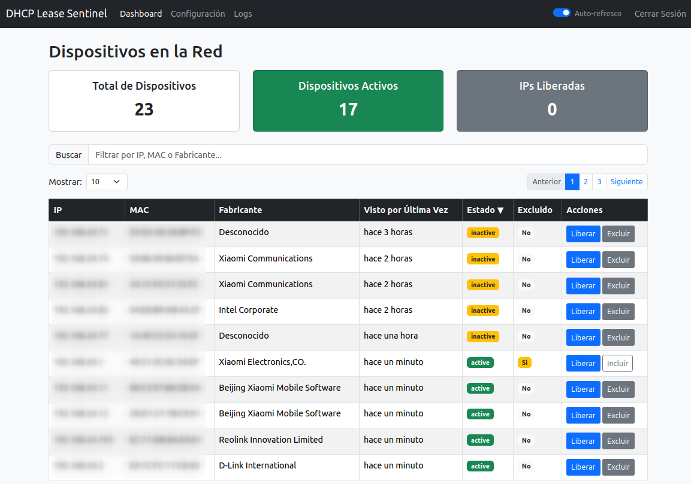
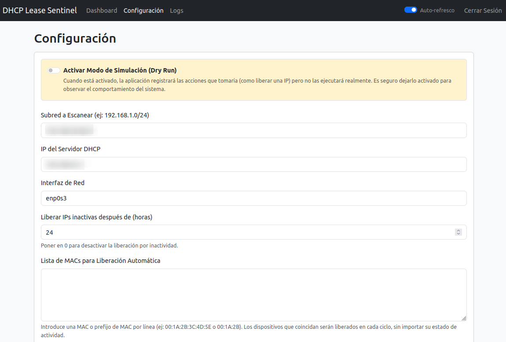

# DHCP Sentinel

DHCP Sentinel es un auditor de red que trabaja junto a tu servidor DHCP existente. Su misión es simple: recuperar direcciones IP no utilizadas para evitar que el pool de tu DHCP se agote. La aplicación identifica dispositivos que han estado inactivos por mucho tiempo o que pertenecen a una lista específica (ej. invitados) y envía una solicitud de liberación (DHCPRELEASE) en su nombre, manteniendo así el pool de direcciones IP limpio y disponible.

## Características

-   **Panel de Control Centralizado**: Un dashboard limpio que muestra una lista ordenable y con búsqueda de todos los dispositivos descubiertos, junto con estadísticas clave (total de dispositivos, activos, IPs liberadas).
-   **Descubrimiento Activo de Dispositivos**: Escanea la red periódicamente usando Nmap para descubrir hosts activos, sus direcciones MAC y fabricantes, manteniendo la lista de dispositivos siempre actualizada.
-   **Liberación Manual de IP**: Fuerza un `DHCPRELEASE` para la IP de cualquier dispositivo directamente desde la interfaz de usuario, ideal para acciones inmediatas.
-   **Automatización Inteligente de Liberación**:
    -   **Por Inactividad**: Libera automáticamente las IPs de dispositivos que han estado inactivos durante un número de horas definido por el usuario.
    -   **Por Lista de MACs**: Libera automáticamente las IPs de dispositivos cuya dirección MAC coincide con una lista configurable (útil para dispositivos de invitados o IoT que no necesitan una IP permanente).
-   **Exclusión de Dispositivos Críticos**: Protege equipos importantes (como servidores, impresoras o puntos de acceso) marcándolos como "excluidos" para que nunca sean afectados por las acciones de liberación automática.
-   **Acceso Seguro**: Toda la aplicación está protegida por un sistema de login con usuario y contraseña.
-   **Registro de Eventos**: Todas las acciones importantes (escaneos, liberaciones manuales y automáticas, errores) se registran y se pueden visualizar dentro de la aplicación.
-   **Modo Simulación (Dry Run)**: Permite ejecutar la aplicación en un modo seguro que registra las acciones que *tomaría* sin ejecutarlas realmente, perfecto para pruebas y configuración inicial.

## Vistas de la Aplicación

<table>
  <tr>
    <td align="center"></td>
    <td align="center"></td>
  </tr>
  <tr>
    <td align="center"><em>Dashboard Principal</em></td>
    <td align="center"><em>Panel de Configuración</em></td>
  </tr>
</table>

## Lógica de Funcionamiento

El sistema opera con dos componentes principales: la **Interfaz Web** (manejada por Flask) y un **Worker en Segundo Plano** (`scanner_worker.py`).

-   La **Interfaz Web** te permite ver el estado de la red y realizar acciones manuales inmediatas.
-   El **Worker en Segundo Plano** es el motor de la automatización. Se ejecuta en un bucle constante para descubrir dispositivos y aplicar las reglas de liberación que hayas configurado.

### El Ciclo del Worker (cada 60 segundos)

El `scanner_worker.py` realiza las siguientes tareas en cada ciclo:

1.  **Fase de Descubrimiento**: Lanza un escaneo Nmap en la subred configurada para encontrar dispositivos activos.
2.  **Fase de Sincronización**: Actualiza la base de datos con los dispositivos encontrados. Si un dispositivo conocido es visto, se actualiza su marca de tiempo `last_seen`. Si es un dispositivo nuevo, se añade a la base de datos.
3.  **Fase de Automatización**: Revisa la lista de dispositivos y aplica las reglas de liberación automática (ver tabla abajo).

### Acciones Manuales (Desde la Interfaz Web)

Estas son acciones que tú inicias y que tienen efecto inmediato.

| Acción | Activación | Resultado Inmediato |
| :--- | :--- | :--- |
| **Liberar IP** | Clic en el botón **"Liberar"** de un dispositivo. | El sistema envía **inmediatamente** un paquete `DHCPRELEASE` para esa IP. |
| **Excluir Dispositivo** | Clic en el botón **"Excluir"** de un dispositivo. | El dispositivo queda **protegido** de todas las acciones automáticas. |
| **Incluir Dispositivo** | Clic en el botón **"Incluir"** de un dispositivo excluido. | El dispositivo vuelve a ser un **candidato** para las acciones automáticas. |

### Lógica de Automatización (Realizada por el Worker)

Estas son las reglas que el worker aplica automáticamente en cada ciclo.

| Criterio | Condición para Actuar | Aclaración Importante |
| :--- | :--- | :--- |
| **Liberación por Inactividad** | Un dispositivo **no excluido** no ha sido visto (`last_seen`) en más tiempo que el umbral de horas configurado. | La opción "Liberar IPs inactivas después de (horas)" debe ser mayor que 0. |
| **Liberación por Lista de MACs**| La MAC de un dispositivo **no excluido** coincide con una entrada en la lista de MACs para liberación automática. | Esta regla se aplica **incluso si el dispositivo está activo**. Es útil para dispositivos de "usar y tirar". |
| **Rol de la Exclusión** | El dispositivo tiene el estado `is_excluded = true`. | **Un dispositivo excluido está protegido y es IGNORADO por todas las reglas de automatización.** |

## Tecnologías Utilizadas

-   **Backend**: Flask, SQLAlchemy, Flask-Login, Flask-Bcrypt
-   **Redes**: Scapy, python-nmap
-   **Base de Datos**: SQLite (a través de Flask-SQLAlchemy y Flask-Migrate)
-   **Frontend**: Bootstrap 5, Day.js

## Instrucciones de Instalación

Sigue estos pasos para configurar y ejecutar el proyecto en un sistema Linux basado en Debian (como Ubuntu).

### 1. Prerrequisitos

Primero, asegúrate de tener Git, Python y Nmap instalados en tu sistema.

```bash
sudo apt update
sudo apt install -y git python3 python3-pip python3-venv nmap
```

### 2. Clonar el Repositorio

Clona este repositorio en tu máquina local.

```bash
git clone https://github.com/soyunomas/dhcp-sentinel-backend.git
cd dhcp-sentinel-backend
```

### 3. Configurar el Entorno de Python

Crea y activa un entorno virtual para gestionar las dependencias.

```bash
# Crea el entorno virtual
python3 -m venv venv

# Actívalo
source venv/bin/activate
```

### 4. Instalar Dependencias

Instala todas las librerías de Python requeridas desde el archivo `requirements.txt`.

```bash
pip install -r requirements.txt
```

### 5. Configurar la Base de Datos

Aplica las migraciones de la base de datos para crear el archivo `app.db` con el esquema correcto.

```bash
# Exporta la variable de entorno de Flask
export FLASK_APP=run.py

# Aplica las migraciones
flask db upgrade
```

### 6. Crear el Usuario Administrador

Necesitas crear el usuario administrador inicial para poder iniciar sesión. Ejecuta el shell de Flask y los siguientes comandos de Python.

```bash
# Inicia el shell
flask shell
```

Ahora, dentro de la consola de Python:
```python
# Importa los módulos necesarios
from app import db
from app.models import User

# Crea una nueva instancia de usuario (puedes cambiar 'admin' si lo deseas)
u = User(username='admin')

# Establece una contraseña segura (REEMPLAZA 'tu_contraseña_segura' con tu contraseña real)
u.set_password('tu_contraseña_segura')

# Añade a la sesión de la base de datos y confirma los cambios
db.session.add(u)
db.session.commit()

# Sal del shell
exit()
```

## Ejecutando la Aplicación

La aplicación requiere que dos procesos se ejecuten en dos terminales diferentes, ambos con privilegios `sudo` para operaciones de red.

**Advertencia de Seguridad:** Ejecutar procesos con `sudo` otorga privilegios elevados. Asegúrate de ejecutar esta aplicación en una red de confianza y en un sistema seguro.

### Terminal 1: Ejecutar el Servidor Web

```bash
# Asegúrate de que tu entorno virtual está activo
source venv/bin/activate

sudo setcap cap_net_raw=eip $(readlink -f venv/bin/python)

# Inicia el servidor web de Flask
venv/bin/python run.py
```
Esto hará que la interfaz web esté disponible en `http://<ip-de-tu-servidor>:5001`.

### Terminal 2: Ejecutar el Worker de Escaneo

```bash
# Asegúrate de que tu entorno virtual está activo
source venv/bin/activate

# Inicia el worker de escaneo y automatización en segundo plano
sudo venv/bin/python scanner_worker.py
```
Este proceso se encargará del descubrimiento de dispositivos y las liberaciones automáticas de IP.

### Configuración Final

1.  Abre tu navegador web y navega a `http://127.0.0.1:5001`.
2.  Inicia sesión con el nombre de usuario y la contraseña que creaste en el paso 6.
3.  Ve a la pestaña **"Configuración"**.
4.  **Crucialmente, actualiza los parámetros de red** (Subred a Escanear, IP del Servidor DHCP y especialmente la **Interfaz de Red**) para que coincidan con la configuración de tu red.
5.  Revisa las reglas de automatización y el modo de simulación (Dry Run) según tus necesidades.
6.  Guarda los cambios. La aplicación ya está completamente operativa.

---

> [!WARNING]
> ## Aviso Legal y de Responsabilidad
>
> Este software se proporciona "tal cual", sin garantía de ningún tipo. **El uso de DHCP Sentinel es bajo su entera responsabilidad.**
>
> Esta aplicación interactúa directamente con su red y puede causar interrupciones en el servicio si se configura incorrectamente. Se recomienda encarecidamente:
>
> 1.  **Probar primero en un entorno no crítico.**
> 2.  Utilizar el **"Modo Simulación (Dry Run)"** para observar el comportamiento sin realizar cambios reales.
> 3.  **Excluir siempre los dispositivos críticos** (servidores, routers, switches, etc.).
>
> Los autores no se hacen responsables de ningún daño que pueda surgir del uso de este software.

---

## TO-DO (Próximas Mejoras)

*   [x] **Añadir el período de escaneo a la configuración:** Permitir al usuario modificar el `SCAN_INTERVAL_SECONDS` (actualmente fijo en 60 segundos) desde la interfaz web para ofrecer más flexibilidad.
*   [ ] En Sniffer pasivo, enviar pings para actualizar el dashboard y ver si están activos.
*   [ ] Implementar notificaciones (ej. por email o Telegram) para eventos críticos.
